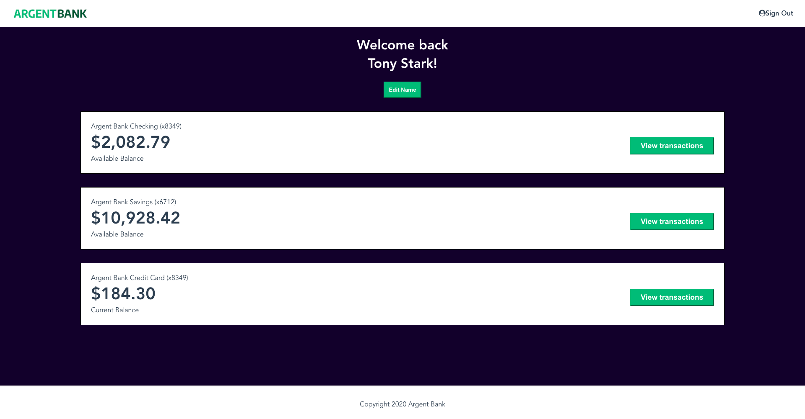

# Argent Bank - API Authentication w/ React, Redux & RTK Query

## General Informations

Argent Bank is the 13th project of my Open Classrooms JavaScript / React Developper Diploma

This is a basic demo of authentication to, and use of protected endpoints of an API.

### Tools

JWT Tokens, React, Redux & the RTK Query Tool

## Screenshot

## Setup

### API

[Source code available here](https://github.com/OpenClassrooms-Student-Center/Project-10-Bank-API/)

The backend url must be included in this repo [src/redux/services/BACKEND_URL.js](src/redux/services/BACKEND_URL.js)

##
# Getting Started with Create React App and Redux

This project was bootstrapped with [Create React App](https://github.com/facebook/create-react-app), using the [Redux](https://redux.js.org/) and [Redux Toolkit](https://redux-toolkit.js.org/) template.

## Available Scripts

In the project directory, you can run:

### `npm start`

Runs the app in the development mode.\
Open [http://localhost:3000](http://localhost:3000) to view it in your browser.

The page will reload when you make changes.\
You may also see any lint errors in the console.

### `npm run build`

Builds the app for production to the `build` folder.\
It correctly bundles React in production mode and optimizes the build for the best performance.

The build is minified and the filenames include the hashes.\
Your app is ready to be deployed!

See the section about [deployment](https://facebook.github.io/create-react-app/docs/deployment) for more information.
